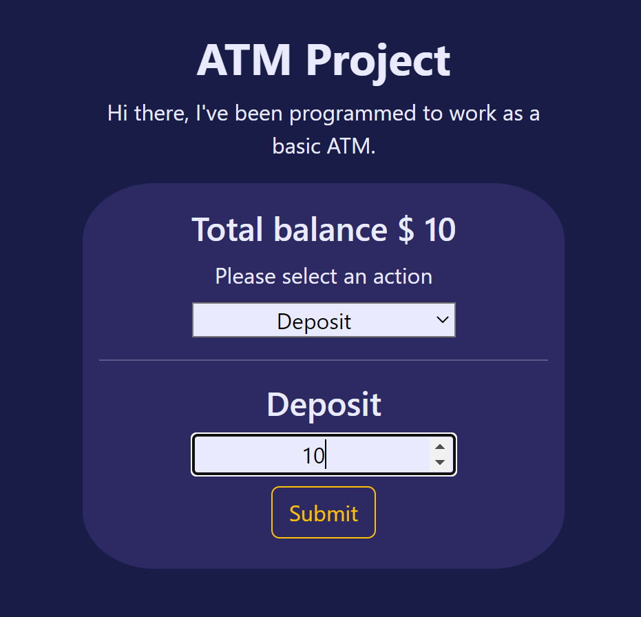

<div align="center" id="top"> 
  

&#xa0;

<a href="https://giankbo.github.io/atm-project/" target="blank">Demo</a>

</div>

<h1 align="center">ATM Project</h1>

<p align="center">
  

  

  

  
</p>

<p align="center" markdown="1">
  In this MIT xPRO React project, we implement a basic ATM by creating a functional component that handles the ATM deposits and withdrawals and also tracks the state of the deposits.
</p>

<p align="center">
   <a href="#writing_hand-features">Features</a>
   ·
   <a href="#checkered_flag-how-to-run">How to run</a>
   ·
   <a href="#factory-improvements">Improvements</a>
   ·
   <a href="#handshake-credits">Credits</a>
   ·
   <a href="#memo-license">License</a>
   ·
   <a href="https://github.com/giankbo" target="blank">Author</a>
</p>

<br>

## :writing_hand: Features

- Implementation of React components.
- Use of State.
- Validation of the form content in conjunction with state of other components.

## :checkered_flag: How to run

Before starting, you need to have [Git](https://git-scm.com) and [Visual Studio Code](https://code.visualstudio.com/) installed. Then, clone the repo:

```bash
# Clone this project
$ git clone https://github.com/giankbo/atm-project
# Access
$ cd atm-project
# Install http-server via npm
$ npm install --global http-server
# Start the server
$ http-server -c-1

Once the steps are done, you can visit http://localhost:8080 to view your server.
```

## :factory: Improvements

- Added validation to not withdraw more than we have.
- Modified user interface for better user understanding.

## :handshake: Credits

<a href="https://xpro.mit.edu/" target="_blank">MIT xPRO</a>

## :memo: License

This project is under license from MIT. For more details, see the [LICENSE](LICENSE.md) file.

&#xa0;

<a href="#top">Back to top</a>

